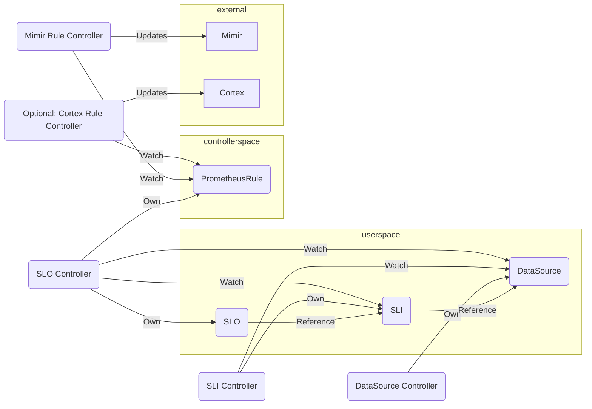
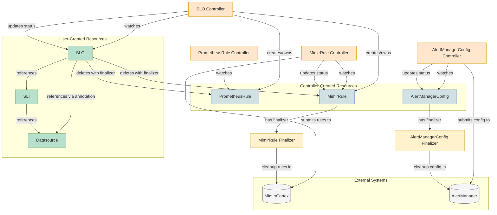

# osko - OpenSLO Kubernetes Operator

## Introduction

This operator aims to provide it's users with simple management of SLIs, SLOs, alerting rules and alerts routing via Kubernetes CRDs according to the (not only) the [OpenSLO](https://github.com/OpenSLO/OpenSLO) specification (currently `v1`).

## Goals

The goals of the operator are to take **inputs** in the form of metrics from supported datasources (`Mimir`, `Cortex` for a start) and produce **outputs** in the form of Prometheus `rules` in the form of the [`PrometheusRule`](https://prometheus-operator.dev/docs/operator/design/#prometheusrule) CRDs based on set `OpenSLO`s.

### Example inputs and outputs

#### Inputs

[kind: Datasource `spec.connectionDetails`](https://github.com/oskoperator/osko/blob/main/apis/openslo/v1/datasource_types.go#L11)

#### Outputs

[`PrometheusRule`](https://prometheus-operator.dev/docs/operator/design/#prometheusrule)

If the target system is unable to reconcile the created [`PrometheusRule`](https://prometheus-operator.dev/docs/operator/design/#prometheusrule)s on it's own (like [prometheus-operator](https://github.com/prometheus-operator/prometheus-operator)), we allow extending our operator with controllers that will be able to reconcile [`PrometheusRule`](https://prometheus-operator.dev/docs/operator/design/#prometheusrule)s against specific target systems (any arbitrary API, for example [`Cortex`s Ruler](https://cortexmetrics.io/docs/api/#ruler)).

## Non-Goals

- Support the full OpenSLO specification from the get-go, **if ever**
  - The goal here is to be _compatible_ with the OpenSLO spec, not necessarily fully implement it
  - MRs (PRs) are welcome for any missing functionality.

# Technical notes

- We should look into how to implement [Multiwindow, Multi-Burn-Rate Alerts](https://sre.google/workbook/alerting-on-slos/#6-multiwindow-multi-burn-rate-alerts) based on the OpenSLO spec

## Design

## Resource Lifecycle

