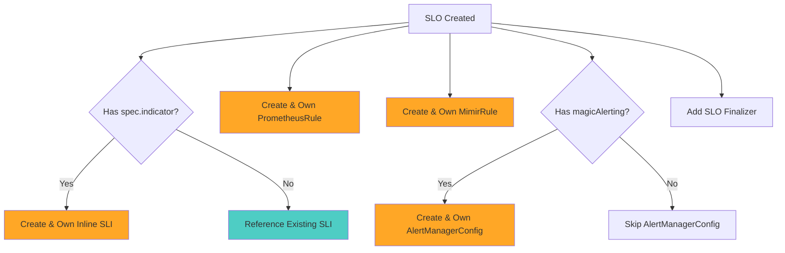
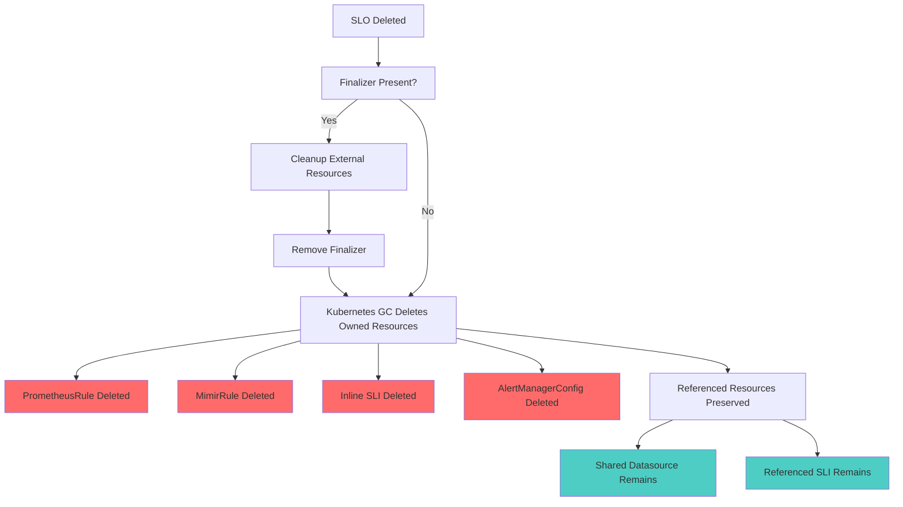

# OSKO Ownership Model

This document describes the Kubernetes ownership model implemented in OSKO for proper resource lifecycle management and cascading deletion behavior.

## Overview

OSKO implements a proper Kubernetes ownership model that distinguishes between **owned resources** (which are deleted when the owner is deleted) and **referenced resources** (which are shared infrastructure and preserved across SLO deletions).

## Problem Statement

The original design had unclear ownership semantics:
- No clear distinction between SLO-specific resources and shared infrastructure
- Potential resource leaks when SLOs were deleted
- Inconsistent cascading deletion behavior
- Risk of accidentally deleting shared resources

## Ownership Model

### Owned Resources (Cascading Deletion)

When an SLO is created, it **owns** these resources via `OwnerReferences`:

| Resource | Condition | Purpose |
|----------|-----------|---------|
| `SLI` | When using `spec.indicator` (inline SLI) | SLO-specific service level indicator |
| `PrometheusRule` | Always created | SLO monitoring rules |
| `MimirRule` | Always created | Mimir-specific rules |
| `AlertManagerConfig` | When `osko.dev/magicAlerting: "true"` | SLO-specific alert routing |

### Referenced Resources (Preserved)

These resources are **referenced** but **not owned** by SLOs:

| Resource | Reference Method | Reason |
|----------|------------------|--------|
| `Datasource` | `osko.dev/datasourceRef` annotation | Shared infrastructure |
| `SLI` | When using `spec.indicatorRef` | May be shared by multiple SLOs |
| `AlertPolicy` | Direct reference | Shared alerting policies |
| `AlertCondition` | Direct reference | Reusable alert conditions |
| `AlertNotificationTarget` | Direct reference | Shared notification channels |

## Resource Lifecycle

### Creation Flow



### Deletion Flow



## Implementation Details

### SLO Controller Changes

The SLO controller now implements:

1. **Finalizer Management**: Adds `finalizer.slo.osko.dev` to ensure proper cleanup
2. **Inline SLI Creation**: Creates and owns SLI resources when `spec.indicator` is used
3. **Owner Reference Setting**: Properly sets owner references on created resources
4. **AlertManagerConfig Creation**: Creates alert routing when magic alerting is enabled

```go
// Example owner reference setting
if err := controllerutil.SetOwnerReference(slo, prometheusRule, r.Scheme); err != nil {
    return err
}
```

### RBAC Requirements

The SLO controller requires these additional permissions:

```yaml
# SLI management for inline SLIs
- apiGroups: ["openslo.com"]
  resources: ["slis"]
  verbs: ["get", "list", "watch", "create", "update", "patch", "delete"]

# AlertManagerConfig management
- apiGroups: ["osko.dev"]
  resources: ["alertmanagerconfigs"]
  verbs: ["get", "list", "watch", "create", "update", "patch", "delete"]

# Finalizer management
- apiGroups: ["openslo.com"]
  resources: ["slos/finalizers"]
  verbs: ["update"]
```

## Usage Patterns

### Pattern 1: SLO with Shared SLI

```yaml
apiVersion: openslo.com/v1
kind: SLO
metadata:
  name: my-slo
  annotations:
    osko.dev/datasourceRef: "shared-datasource"
spec:
  indicatorRef: "shared-http-sli"  # References existing SLI
  # ... rest of spec
```

**Ownership**: SLO owns PrometheusRule, MimirRule. Does NOT own the referenced SLI.

### Pattern 2: SLO with Inline SLI

```yaml
apiVersion: openslo.com/v1
kind: SLO
metadata:
  name: my-slo
  annotations:
    osko.dev/datasourceRef: "shared-datasource"
spec:
  indicator:  # Inline SLI definition
    metadata:
      name: my-specific-sli
    spec:
      # ... SLI spec
```

**Ownership**: SLO owns PrometheusRule, MimirRule, and the created SLI.

### Pattern 3: SLO with Magic Alerting

```yaml
apiVersion: openslo.com/v1
kind: SLO
metadata:
  name: my-slo
  annotations:
    osko.dev/datasourceRef: "shared-datasource"
    osko.dev/magicAlerting: "true"
spec:
  # ... rest of spec
```

**Ownership**: SLO owns PrometheusRule, MimirRule, and AlertManagerConfig.

## Best Practices

### Resource Organization

1. **Shared Infrastructure**: Create Datasources separately and reference them
2. **Reusable SLIs**: Create SLI resources separately if used by multiple SLOs
3. **SLO-Specific SLIs**: Use inline SLI definitions for SLO-specific metrics
4. **Alert Management**: Use magic alerting for simple cases, explicit AlertPolicies for complex routing

### Naming Conventions

- Inline SLIs: `{slo-name}-sli` or use `spec.indicator.metadata.name`
- AlertManagerConfigs: `{slo-name}-alerting`
- Use consistent labeling: `osko.dev/slo: {slo-name}`

### Resource Cleanup

1. **Automatic**: Owned resources are automatically deleted via Kubernetes garbage collection
2. **Manual**: Use finalizers for external system cleanup (Mimir rules, AlertManager configs)
3. **Verification**: Always verify cascading deletion works as expected in non-production environments

## Migration Guide

### From Previous Versions

If upgrading from a version without proper ownership:

1. **Backup**: Export all existing SLO-related resources
2. **Apply**: Deploy the new controller version
3. **Reconcile**: Existing SLOs will be reconciled and gain proper ownership
4. **Verify**: Check that owner references are set correctly

### Verification Commands

```bash
# Check SLO and its owned resources
kubectl get slo my-slo -o yaml | grep -A 10 ownerReferences

# Verify owned resources have owner references
kubectl get prometheusrule my-slo -o yaml | grep -A 5 ownerReferences
kubectl get mimirrule my-slo -o yaml | grep -A 5 ownerReferences

# Test cascading deletion (in non-production!)
kubectl delete slo my-slo
kubectl get prometheusrule,mimirrule,sli,alertmanagerconfig
```

## Troubleshooting

### Common Issues

1. **Resources not deleted**: Check if owner references are set correctly
2. **Shared resources deleted**: Verify you're not accidentally owning shared resources
3. **Finalizer stuck**: Check external system connectivity for cleanup

### Debug Commands

```bash
# Check finalizers on SLO
kubectl get slo my-slo -o jsonpath='{.metadata.finalizers}'

# Check owner references on owned resource
kubectl get prometheusrule my-slo -o jsonpath='{.metadata.ownerReferences}'

# Check SLO controller logs
kubectl logs -n osko-system deployment/osko-controller-manager
```

## Future Enhancements

- Support for cross-namespace resource references
- Soft deletion with retention policies
- Advanced cleanup strategies for external systems
- Ownership validation webhooks
